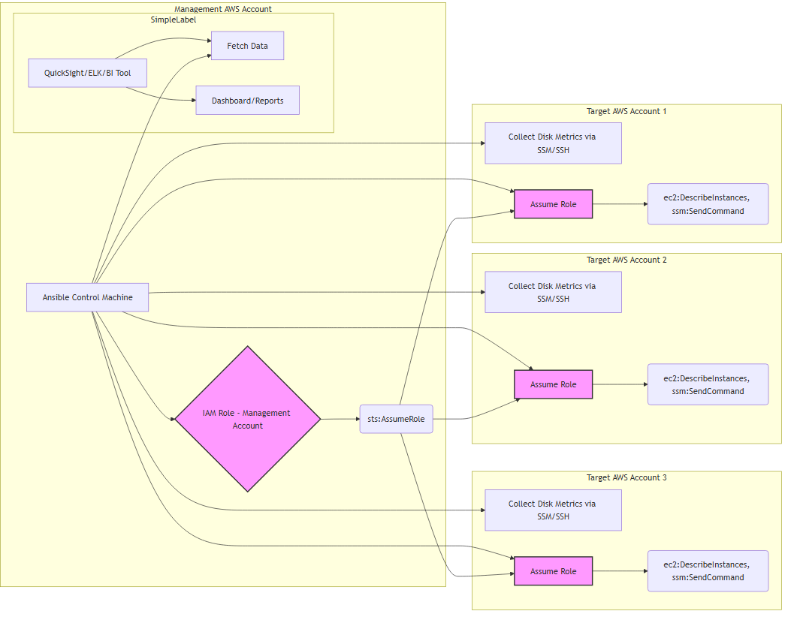

# Multi-Account AWS EC2 Disk Utilization Monitoring

Background: 
You are a Solutions architect at a large enterprise that utilizes AWS cloud services. The company has grown through acquisitions and now manages 3 separate AWS accounts, each containing numerous EC2 instances. The CTO has expressed concerns about potential disk space issues across these instances and wants a comprehensive solution to monitor disk utilization. 


Assignment: 

Company is internally using a configuration management tool (Ansible). Before investing into other tools, the company has decided to use Ansible to perform the required metric collection. 

Design and outline a solution to fetch and report disk utilization from all EC2 instances across the 3 AWS accounts. Your solution should address the following points: 
1.  How would you centralize access and management of the 3 AWS accounts? 
2.  How would you aggregate the collected data from all accounts into a single, easily digestible format? 
3.  How would your solution scale if the company acquires more companies and AWS accounts in the future?
   

Deliverables: 
1. Provide a high-level architectural diagram of your proposed solution. 
2. Provide the ansible playbook 
3. Summarize the various component involved in the process

This project provides a solution to monitor disk utilization across multiple AWS accounts using Ansible. The solution leverages AWS IAM roles for cross-account access, collects disk utilization metrics, and stores the data in a centralized location for reporting.

## Table of Contents
1. [Architecture](#architecture)
2. [Prerequisites](#prerequisites)
3. [Setup](#setup)
4. [Usage](#usage)
5. [Components](#components)

## Architecture



## Prerequisites

- AWS CLI installed and configured with access to the required accounts.
- Ansible installed on the control machine.
- Python and necessary libraries installed for generating reports.

## Setup

1. **Create IAM Roles in Each AWS Account:**
   - Create a role named `EC2MonitoringRole` in each AWS account.
   - Attach the following policy to the role:

   ```json
   {
       "Version": "2012-10-17",
       "Statement": [
           {
               "Effect": "Allow",
               "Action": [
                   "ec2:DescribeInstances",
                   "cloudwatch:GetMetricData"
               ],
               "Resource": "*"
           }
       ]
   }


## Usage

1. **Run the Ansible Playbook:**

ansible-playbook -i ansible/inventory ansible/playbooks/monitor_disk_utilization.yml

1. **View the Report:**
The report will be generated and uploaded to the S3 bucket. You can view it by navigating to the S3 bucket or accessing the link sent via email.

## Components

1. **IAM Roles and Cross-Account Role Assumption:**
IAM roles are created in each AWS account to allow the Ansible control machine to assume them.
Trust relationships are set up to allow the Ansible control machine to assume the roles.

2. **Ansible Control Machine:**
The Ansible control machine runs the playbook to collect disk utilization data.
It assumes the IAM roles in each AWS account to gain access to the necessary resources.

3. **AWS SDK for Python (Boto3):**
Boto3 is used to interact with AWS services such as EC2, CloudWatch, and S3.

4. **Centralized Data Store:**
S3 is used to store the collected disk utilization data.
RDS can be used for more complex data storage and querying needs.

5. **Monitoring and Reporting Dashboard:**
A Python script (generate_report.py) is used to generate a report from the collected data.
The report is stored in S3 and can be accessed via a web interface or sent via email.

## Set the trust relationship to allow the Ansible control machine to assume the role:
   
   ```json
   {
    "Version": "2012-10-17",
    "Statement": [
        {
            "Effect": "Allow",
            "Principal": {
                "AWS": "arn:aws:iam::<AnsibleControlMachineAccountID>:root"
            },
            "Action": "sts:AssumeRole"
        }
    ]
}
